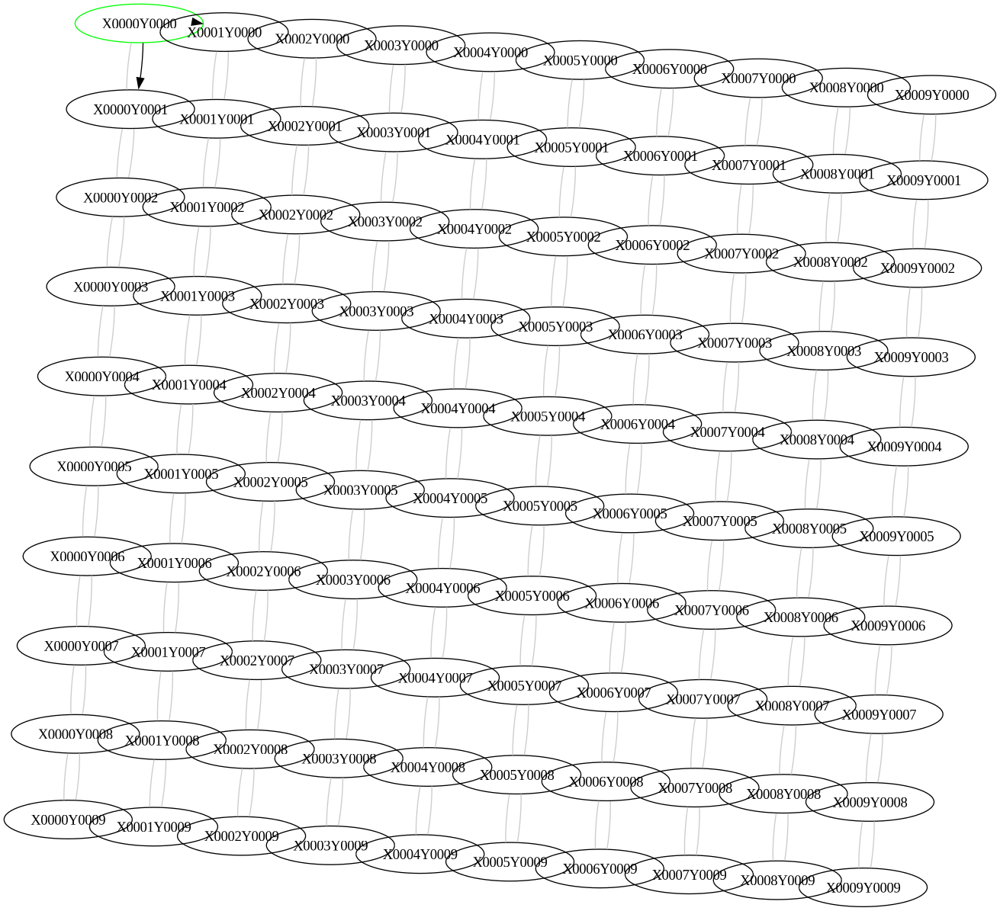
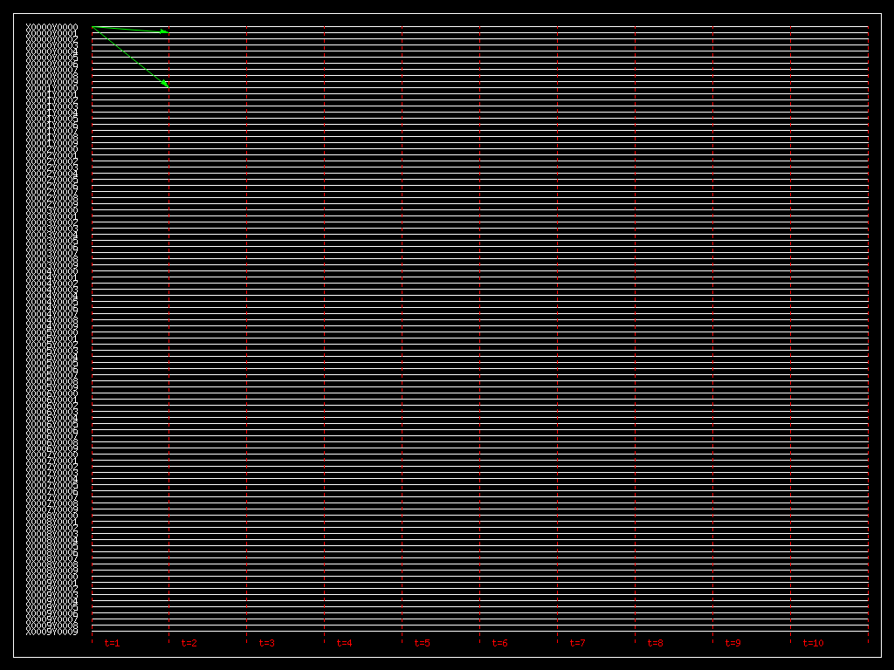

# dssim

Dssim is a distributed system simulator that allows users to simulate the behavior of homogeneous agents that follow a protocol to achieve a common goal. The simulator is inspired by the textbook "Design and Analysis of Distributed Algorithms" by Nicola Santoro. The simulator is written in written in C/Lua/OpenCL.

As of now, the simulator is no longer maintained or developed and has been superseded by the [herdsim](https://github.com/mmirko/herdsim) simulator written in [Pony](https://www.ponylang.io/).

## Installation

In order to install the simulator, you need to have the following dependencies installed, all with the development environment as well:

- graphviz
- lua
- openCL
- mplayer (mencoder)

The simulator does not really require a proper installation process, as it is a simple C program that can be compiled with a simple `make` command.
To create the simulator executable, you need to run the following commands:

```bash
git clone https://github.com/mmirko/dssim.git
cd dssim
make
```

After the compilation, the simulations can be run directly using the Makefile inside one of the example directories. As described in the next section, the Makefile will generate the necessary input files and run the simulation.

## Usage

Inside an example directory, there are several files that are used to run the simulation. All the examples share the same structure, ruled by a Makefile that is a symlink to the file `../MakefileProtoctol`. The Makefile include the local configuration file `local.mk` that contains the configuration of the simulation. The configuration file contains the following variables:

- `NAME` The name of the simulation.
- `PROTOCOL` The name of the protocol to be used. Corresponds to the name of the Lua protocol file and the initial state file `$PROTOCOL.init`
- `GRAPH` The name of the graph file to be used (without the .dot extension). The graph file is a DOT file that describes the graph of the simulation.
- `SIMTIME` The time of the simulation with the -t argument. For example -t 1000 means that the simulation will run for 1000 time units.
- `RENDERER` The renderer to be used with the -T argument. The renderer is the graphviz renderer that will be used to render the graph of the simulation. For example, -T neato will use the neato renderer.
- `BYPASS` The argument -b if the simulation should bypass the termination detection.

The files that are used to run the simulation are the following:

- `local.mk` The configuration file of the simulation previously described.
- `protocol` The Lua file that contains the protocol of the agents. It ususally has no extension.
- `protocol.init` The initial state of the agents. It is a Lua file that contains the initial state of the agents.
- `graph.dot` The graph file that describes the graph of the simulation with the dot extension.

Once these files are in place, the simulation can be run with the following Makefile targets:

- `simulate` Run the simulation with the configuration described in the `local.mk` file. This is also the default target.
- `video-graph` Generate a video of the graph of the simulation.
- `video-ted` Generate a video of the TED diagram of the simulation.
- `clean` Clean the generated files of the simulation.

Other targets, more advanced, are available:

- `savekernel` Save the OpenCL kernel of the simulation as generated by the Lua protocol file.
- `usekernel` Use the saved OpenCL kernel to run the simulation.
- `platform` Show the OpenCL platforms available in the system.
- `devices` Show the OpenCL devices available in the system.
- `regression` Run the regression tests of the simulation.
- `regression-update` Update the regression tests of the simulation.

## Example

An example of a simulation is the `proto_flooding_lattice` directory. The directory contains the execution of the flooding protocol in a grid of 10x10 nodes. The protocol file (`flooding`) is:

```lua
registers = { STATE = {"IDLE", "INIT", "DONE"}}
messtypes = { IMPULSE = {"YES"}, BROADCAST = {"SENT"} }
options = { "RESET_MESS" }
actions = {}
restrictions = { "T" }

actions[{"STATE_INIT","IMPULSE_YES"}] = [[
    set STATE=DONE;
    send BROADCAST=SENT to NOTSENDERS;
  ]]

actions[{"STATE_IDLE","BROADCAST_SENT"}] = [[
    set STATE=DONE;
    send BROADCAST=SENT to NOTSENDERS;
  ]]
```

The initial state file (`flooding.init`) is:

```lua
defaults = { "STATE_IDLE", "IMPULSE_NO" , "BROADCAST_NO"}

boundary = {}
boundary[0] = { ["X0000Y0000"] = {"STATE_INIT","IMPULSE_YES"} }

ending = {"STATE_DONE", "IMPULSE_NO" , "BROADCAST_NO" }

styles = { STATE_DONE = { color = "green" } , registers_default = { color = "black" } , BROADCAST_SENT = { arrowhead = "normal", arrowtail = "normal", color = "black" }, messages_default =  { arrowhead = "none", arrowtail = "none", color = "grey80" } }

report = { "TIME_COMPLEXITY", "MESSAGE_COMPLEXITY" }
```

The `local.mk` file, the one that contains the configuration of the simulation, contains the following:

```makefile
NAME=flooding_lattice
PROTOCOL=flooding
GRAPH=lattice10
SIMTIME=-t 100
RENDERER=-T neato
BYPASS=-b
```

The graph file (`lattice10.dot`) is a 10x10 grid of nodes. The graph in the example is the following:


To run the simulation and see all the logs, you can run the following command:

```bash
make simulate
```

To generate a video of the graph of the simulation, you can run the following command:

```bash
make video-graph
```

With this result, you can see the evolution of the graph of the simulation:



To generate a video of the TED diagram of the simulation, you can run the following command:

```bash
make video-ted
```

With this result, you can see the TED diagram of the simulation:


